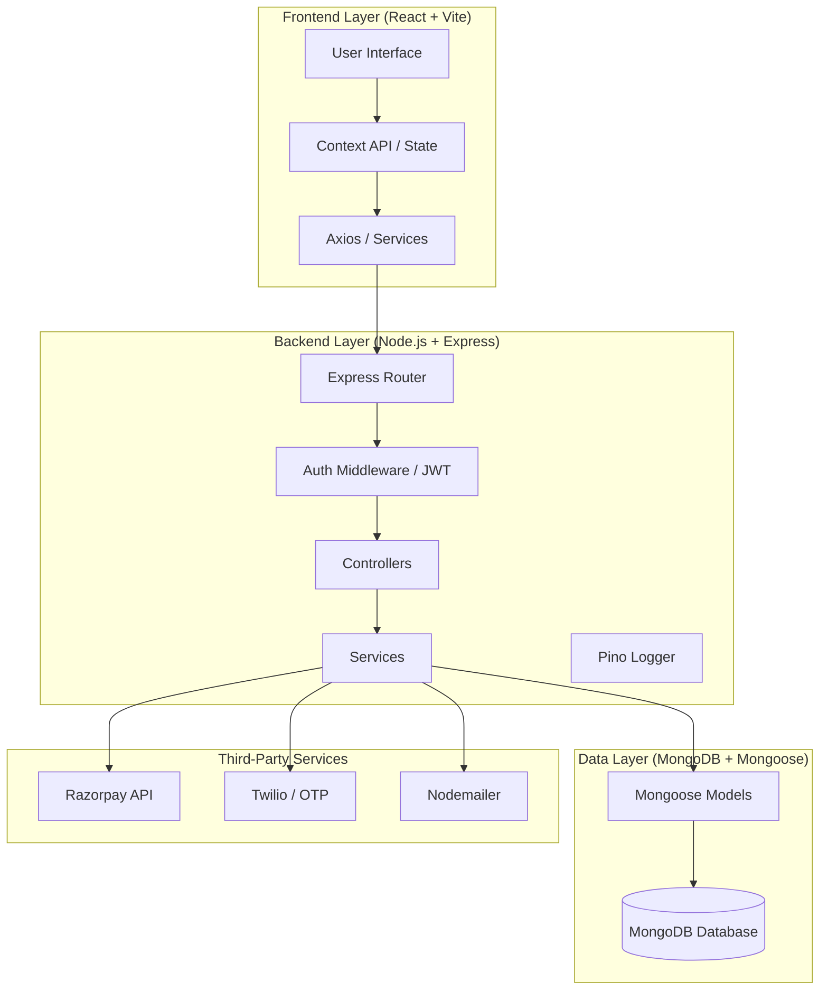
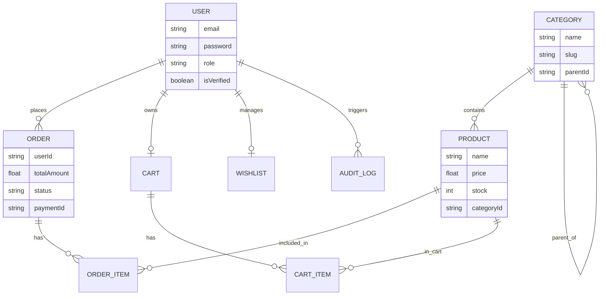

# Project Visual Overview: Threads-Fashion

This document provides visual diagrams for the e-commerce platform's architecture, database schema, and directory structure.

---

## 🏛 Architecture Diagram



---

## 🗄 Database Schema (ERD)



---

## 📁 Project Folder Structure

```text
ecommerce-platform/
├── backend/                       # Node.js + Express + Mongoose
│   ├── src/
│   │   ├── app.ts                 # Application Initialization
│   │   ├── server.ts              # Entry point
│   │   ├── modules/
│   │   │   └── catalog/
│   │   │       ├── controllers/   # Request Handlers
│   │   │       ├── models/        # Mongoose Schema Definitions
│   │   │       ├── services/      # Business Logic
│   │   │       └── routes/        # API Endpoints
│   │   ├── common/                # Shared Utils & Logger
│   │   └── config/                # DB & Environment Config
│   └── package.json
├── frontend/                      # React + TypeScript + Vite
│   ├── src/
│   │   ├── api/                   # Axios instances
│   │   ├── components/            # Reusable UI Atoms/Molecules
│   │   ├── context/               # Global State (Auth, UI)
│   │   ├── hooks/                 # Business Logic Hooks
│   │   ├── pages/                 # Route-level components
│   │   ├── services/              # API implementation
│   │   ├── styles/                # CSS Stylesheets
│   │   └── utils/                 # Utilities & Constants
│   └── package.json
└── backend-spring/                # Spring Boot (Skeleton remains)
    ├── src/main/java/             # (Java source deleted)
    ├── src/main/resources/        # config/application.properties
    └── pom.xml
```
