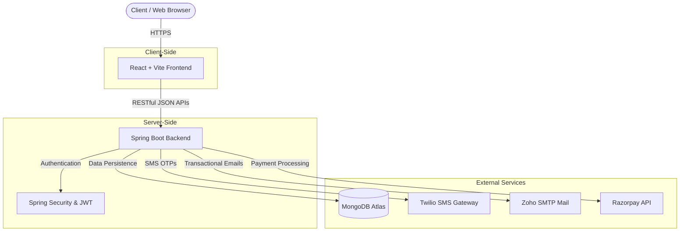

# Threads Fashion 🧵 

[](https://spring.io/projects/spring-boot)
[](https://react.dev/)
[](https://www.docker.com/)
[](LICENSE)
[](#-contributors--contributing)

Threads Fashion is a high-performance, minimalist e-commerce platform designed for professional fashion retail.

---

## 1. 📸 Project Intro

Threads Fashion offers a seamless shopping experience with production-grade security, automated testing, and scalable architecture. 

- **Minimalist Aesthetic**: Clean, high-fashion UI focused on product visualization.
- **Enterprise-ready Backend**: Built on Spring Boot for enhanced type safety, performance, and security.
- **Robust Security**: JWT-based authentication, role-based access control (RBAC), Multi-Factor Authentication (MFA), and sanitization against XSS/NoSQL injections.
- **Full Lifecycle Order Management**: Automated order tracking, returns, exchanges, and payment integration.
- **Persistent Sessions & Device Management**: Tracks geographic location, IP address, and allows revocation of trusted devices.

---

## 2. 🛠️ Tech Stack

### Backend (Spring Boot)
- **Core**: Java 17, Spring Boot 3.3.4
- **Security**: Spring Security 6, JJWT (JSON Web Token)
- **Database**: MongoDB (Atlas)
- **Communications**: Twilio SMS API, Zoho SMTP (Email)
- **Payments**: Razorpay Integration
- **Testing**: JUnit 5, MockMvc

### Frontend (React)
- **Framework**: React 18, Vite
- **State Management**: Context API
- **Styling**: Vanilla CSS (Tailwind Optional)
- **Icons**: Lucide React

---

## 3. 🏗️ Architecture

The system follows a standard modern client-server architecture. Below is a high-level component diagram illustrating the data flow:



### 🗂️ Project Structure

```text
ecommerce-platform/
│
├── backend-spring/              # Spring Boot Backend Application
│   ├── src/main/java/.../       # Java Source Code (Controllers, Services, Models, Repositories, Security)
│   ├── src/test/.../            # JUnit & MockMvc Test Suites
│   ├── Dockerfile               # Containerization config for backend
│   └── pom.xml                  # Maven Dependencies
│
├── frontend/                    # React + Vite Frontend Application
│   ├── src/                     # React Components, Pages, Context, Hooks, and Styles
│   ├── public/                  # Static assets
│   ├── vite.config.ts           # Vite Bundler Configuration
│   └── package.json             # NPM Dependencies
│
├── swagger.json                 # Exported OpenAPI Documentation
├── render.yaml                  # Render PaaS Deployment Blueprint
└── vercel.json                  # Vercel Deployment Configuration
```

### 💡 Techniques Used
- **Stateless Authentication**: Uses JWT (JSON Web Tokens) for managing authentication state securely without server-side memory bloat.
- **Role-Based Access Control (RBAC)**: Fine-grained access control restricting administrative endpoints strictly to `ADMIN` roles.
- **Context API & Custom Hooks**: For global state management (cart, user session) on the React frontend.
- **Global Exception Handling**: Uses Spring's `@ControllerAdvice` to intercept errors and standardize API error responses.
- **Data Transfer Objects (DTOs)**: Isolates database entity models from API responses to prevent data leaks.

---

## 4. 📖 API Documentation (Swagger)

This repository includes a pre-generated `swagger.json` file located in the root directory. This contains the full OpenAPI 3 definition of the backend APIs.

### How to use the Swagger JSON:
If you want to visualize the APIs without starting the application, you can simply upload the `swagger.json` file to [editor.swagger.io](https://editor.swagger.io/).

### How to run it locally:
Once the backend server is running, you can explore, test, and interact with the live endpoints directly from your browser:
- **Swagger UI URL**: `http://localhost:8081/swagger-ui/index.html`
- **OpenAPI JSON Docs**: `http://localhost:8081/v3/api-docs`

*Note: Administrative endpoints and secure user routes will require you to provide a Bearer JWT token in the Swagger Authorize panel.*

---

## 5. ⚙️ Configuration & Setup Guide

### Prerequisites
- **Java 17+**
- **Node.js 18+**
- **Docker** (Optional for local running, required for deployment)

### Environment Variables & Security
**⚠️ IMPORTANT:** Never commit sensitive API keys or credentials. All environment files (e.g., `.env`, `.env.local`) are included in `.gitignore` by default. 

Create a `.env` file in the `backend-spring` directory and `frontend` directory respectively:

**Backend (`backend-spring/.env`)**
```env
MONGO_URI=mongodb+srv://<user>:<password>@cluster.mongodb.net/
MONGO_DB=threads_db
JWT_SECRET=YOUR_32_CHARACTER_SUPER_SECRET_KEY_HERE
MAIL_USER=your_zoho_email@zoho.com
MAIL_PASS=your_zoho_password
RAZORPAY_KEY_ID=your_razorpay_key
RAZORPAY_KEY_SECRET=your_razorpay_secret
TWILIO_ACCOUNT_SID=your_twilio_sid
TWILIO_AUTH_TOKEN=your_twilio_token
TWILIO_FROM_NUMBER=your_twilio_number
PORT=8081
```

**Frontend (`frontend/.env`)**
```env
VITE_API_BASE_URL=http://localhost:8081/api
```

### Local Development

#### Backend
```bash
cd backend-spring
mvn clean install
mvn spring-boot:run
```

#### Frontend
```bash
cd frontend
npm install
npm run dev
```

---

## 6. 🚢 Deployment

### Backend (Render)
This project includes a `render.yaml` Blueprint for instant platform-as-a-service deployment.
1. Connect your GitHub repository to Render.
2. Select the **Blueprint** option.
3. **Security Notice**: Manually add your sensitive secrets (API Keys, MongoDB URI) in the Render Dashboard under **Environment Variables**.

### Frontend (Vercel)
Deploy the frontend seamlessly to Vercel using the provided `vercel.json`.
1. Import the `frontend` folder to Vercel.
2. Set the Environment Variable `VITE_API_BASE_URL` to point to your live Render backend URL.

---

## 7. 🤝 Contributors & Contributing

We welcome and encourage contributors! Whether you are a beginner looking to make your first open-source contribution or an experienced developer looking to improve the core architecture, you are welcome here.

### How to Contribute:
1. **Fork** the repository and create a new branch (`git checkout -b feature/your-feature-name`).
2. Ensure you **do not push sensitive keys** (our `.gitignore` helps, but always double-check).
3. **Commit** your changes (`git commit -m 'Add some amazing feature'`).
4. **Push** to the branch (`git push origin feature/your-feature-name`).
5. Open a **Pull Request** and describe the changes you made.

For major changes, please open an issue first to discuss what you would like to change.

---

## 📜 License
This project is licensed under the MIT License - see the [LICENSE](LICENSE) file for details.

*Developed with precision for high-fashion digital commerce.*
